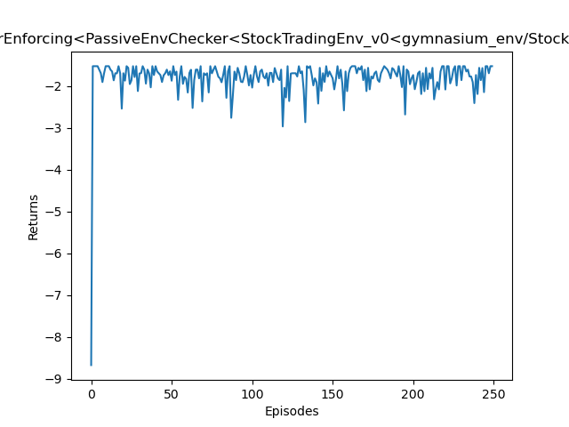
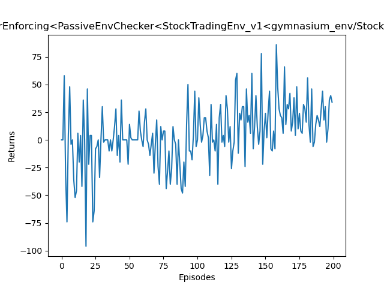
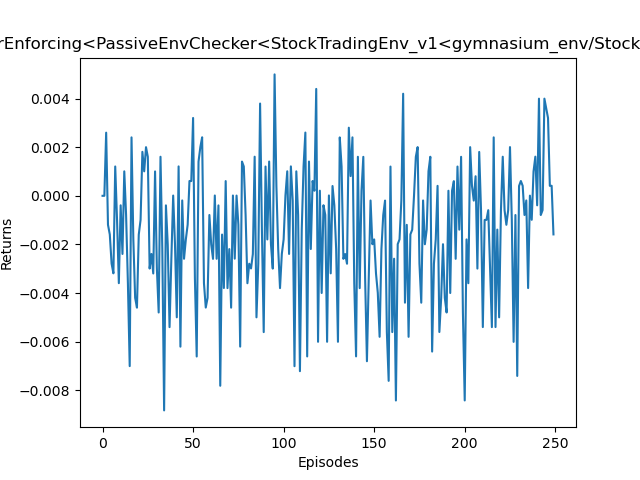
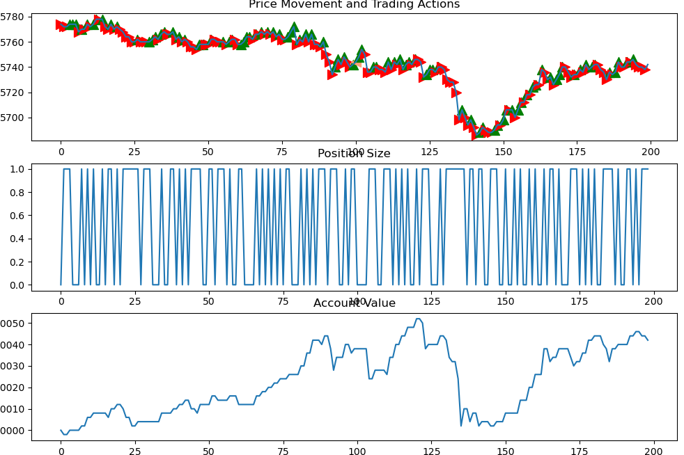

题设关键：使得agent在股票低价时买入，在高价时抛出，从而换取差价，获得高利润。

### 环境设计
- 状态空间
    1. 价格变化率
    2. 价格波动范围
- 动作空间
    1. 卖出全部
    2. 卖出一半
    3. 持有
    4. 买入一半可用资金
    5. 买入全部可用资金
- 奖励 
    $ S $代表总资产，$ C $代表收盘价，$ P $代表持仓股票份额
    1. 方法一：
        1. 基础收益率奖励：$ \frac{S_t - S_{t-1}}{S_{t-1}} $
        2. 持仓风险惩罚（偏离50%仓位）：\
            $ positive\_rate = \frac{P_t*C_t}{S_t} $ \
            $ penalty = -|positive\_rate - 0.5| * 0.1 $
        3. 破产惩罚：如果当前总资产低于初始资金20%，直接扣1奖励
    2. 方法二：
        绝对收益奖励：$ S_t - S_{t-1} $
    3. 方法三：
        相对收益奖励：$ \frac{S_t - S_{t-1}}{S_{t-1}} $

### 结果
针对奖励方法一，训练结果如下：

针对奖励方法二，训练结果如下：

针对奖励方法三，训练结果如下：

根据回报曲线，可以看出奖励方法二的训练效果最好，保存该模型，并可视化其在数据集上的表现：
