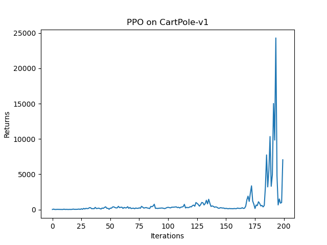
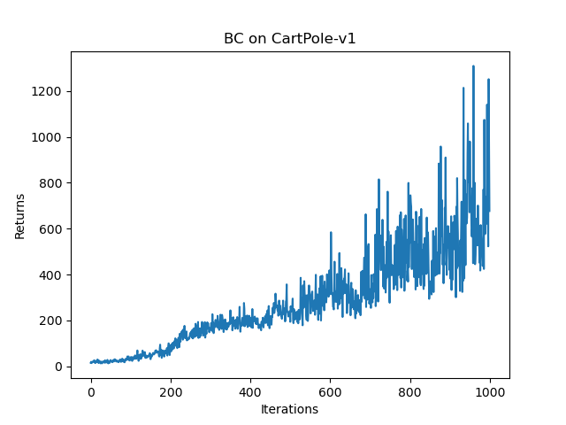
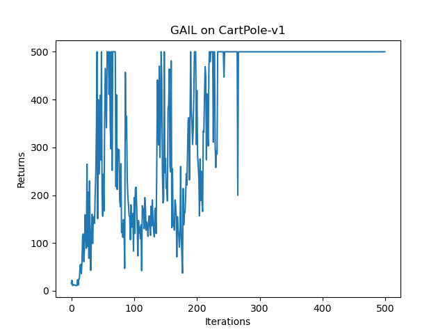

The project is to practice imitation learning under the `CartPole-v1` environment. 
- Behavior Cloning (BC)
- Generative Adversarial imitation learning (GAIL)

To start with the project, you can run the `main.py` file in the `src` folder.
> ps. You should enter the `src` path to run the program.

---
### PPO
I firstly used PPO clip to train an expert agent under the `CartPole-v1` environment.

PPO is a policy gradient algorithm. It is a model-free reinforcement learning algorithm based on the actor-critic algorithm. What specially is that it replace actor loss with the clipped loss, which makes the training more stable.

The train result is shown below:

<video width="600" controls>
  <source src="./src/professional/video/training-episode-150.mp4" type="video/mp4">
  Your browser does not support the video tag.
</video>

---

### Behavior Cloning

Behavior Cloning (BC) defines a policy network only. We only need to compare the expert data and the policy network output. Then apply the maximum likelihood loss to minimize their difference. In this way, we can let the agent learn the expert policy as more as possible.

> For the discrete action space, apply the maximum likelihood. But applying the MSE loss for the continuous action space.

The train result is shown below:

---

### Generative Adversarial Imitation learning (GAIL)

GAIL involves two components: the discriminator and the generator. The discriminator judges how much probability that the given data is from the generator, ranging from 0 to 1. The generator is an agent that takes actions. It takes the negative value of the probability from the discriminator as its reward.

In this situation, the discriminator tries to make the probability of the generator's data as high as possible, while the generator tries to take action just like the expert. The discriminator directs the generator to be better.

The train result is shown below:

We can find the returns of the GAIL is more stable than the BC.